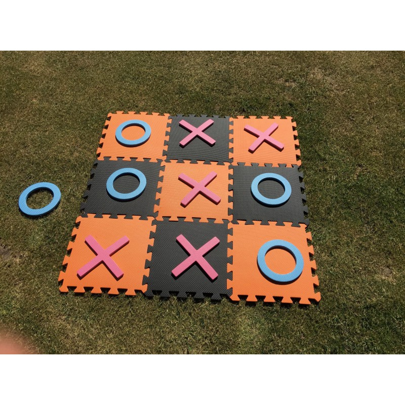

  

# Tic Tac Toe

Bienvenue dans ce jeu de Tic Tac Toe simple mais amusant !

## Aperçu

Ce projet est une implémentation d'un jeu Tic Tac Toe en HTML, CSS et JavaScript. Il vous permet de jouer au célèbre jeu de société directement depuis votre navigateur Web.

## Fonctionnalités

- Interface utilisateur conviviale
- Score suivi pour chaque joueur
- Bouton de recommencement pour démarrer une nouvelle partie

## Comment jouer

1. Ouvrez le fichier `index.html` dans votre navigateur Web.
2. Cliquez sur les cases pour placer votre symbole (X ou O).
3. Essayez de former une ligne, une colonne ou une diagonale de votre symbole pour gagner.
4. Le jeu suivra automatiquement le score pour chaque joueur.
5. Pour démarrer une nouvelle partie, utilisez le bouton "Recommencer".

## Contact

Si vous avez des questions, des suggestions ou des commentaires, n'hésitez pas à me contacter :

Adresse e-mail : eric.antonie.noel92@gmail.com

